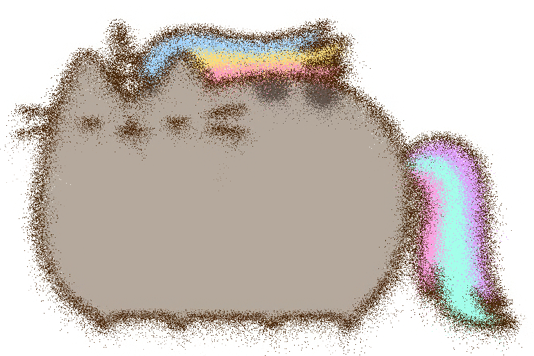
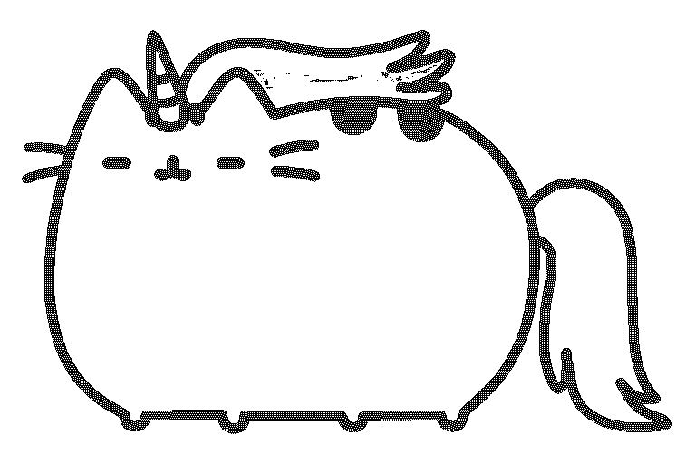
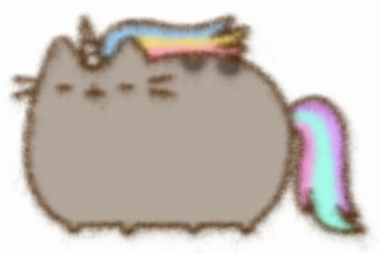

# YLPaintShop
<a href="https://github.com/yuhuili"></a>

YLPaintShop is a Swift library for simple image effects. It is written in Swift 3 and uses Core Graphics.

It is inspired by Stanford CS106B Spring 2016 Assignment Fauxtoshop, which requires a simple photo editor to be built in C++ with Stanford's own library. Same effects are achieved by YLPaintShop in Swift.

## Effects
* Scatter
```
img.scatter(radius)
```

* Paint Edge
```
img.paintEdge(threshold)
```

* Gaussian Blur
```
img.gaussianBlur(radius)
```

## Examples


```
img.scatter(10)
```

------



```
img.paintEdge(140)
```

------


```
img.gaussianBlur(10)
```

------



```
img.scatter(8).gaussianBlur(5)
```

------


```
img.paintEdge(140).gaussianBlur(3)
```
